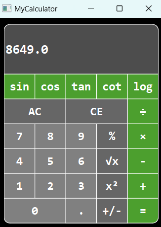

# 17th Assignments in Python

# Calculator Application

This is a simple calculator application built using PySide6, a Python binding for the Qt libraries. It provides a graphical user interface (GUI) for performing basic arithmetic operations and some additional mathematical functions.(It is not a compelete code)

---

## Features:
- Addition, subtraction, multiplication, and division operations.
- Trigonometric functions: sine, cosine, tangent, cotangent.
- Other mathematical functions: square root, square, percentage, logarithm.
- Ability to change the sign of a number.
-  Clear (AC) and Clear Entry (CE) functionalities.

---

## Usage:

1. Run the application by executing the Python script.
2. Use the number buttons to input digits.
3. Click on operator buttons to perform arithmetic operations.
4. Utilize additional function buttons for trigonometric functions, mathematical operations, and sign change.
5. Press the "=" button to get the result of the calculation.
6. Use AC to clear all input and CE to remove the last entered digit.

---

## Requirements

- Python 3.x
- PySide6
- Qt libraries

Install PySide6 using pip:
```
pip install PySide6
```
---

### You can see a picture of Application here:
